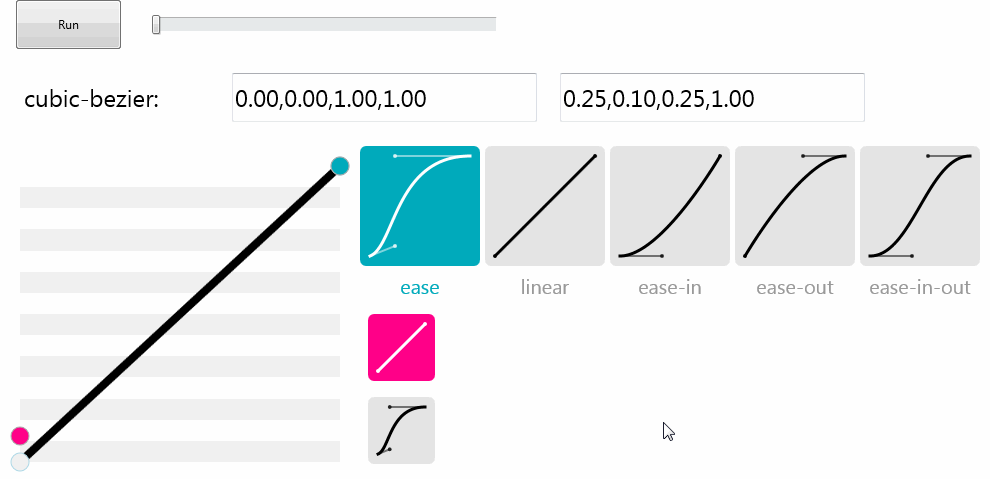

## [TFMXBezierAnimation](https://github.com/zhaoyipeng/FMXComponents/wiki/FMXBezierAnimation)

  

TFMXBezierAnimation component inherit from TFloatAnimation, you can just drop a TFMXBezierAnimation component same as TFloatAnimation.

use these code to set the cubic-bezier parameters
```pascal
  BezierAnimation1.Duration := duration; 
  BezierAnimation1.SetData(X1, Y1, X2, Y2);
  BezierAnimation1.Start;
```

This is the interface of TBezier
```pascal
  TBezier = class
  public
    constructor Create(p1x, p1y, p2x, p2y: Double);
    procedure SetData(p1x, p1y, p2x, p2y: Double);
    function SampleCurveX(t: Double): Double;
    function SampleCurveY(t: Double): Double;
    function SampleCurveDerivativeX(t: Double): Double;
    function SolveCurveX(x, epsilon: Double): Double;
    function Solve(x, epsilon: Double): Double;
    class function GetLinear: TBezier;
    class function GetEase: TBezier;
    class function GetEaseIn: TBezier;
    class function GetEaseOut: TBezier;
    class function GetEaseInOut: TBezier;
  end;
```

there are 5 predefined bezier curves, linear, ease, ease-in, ease-out, ease-in-out, you can call corresponding class function to get the curve.

```pascal
  Ani := TBezier.GetEaseInOut;
  BezierAnimation1.SetBezier(Ani);
```

or you can defined your curve

```pascal
  Ani := TBezier.Create(p1x, p1y, p2x, p2y);
```
