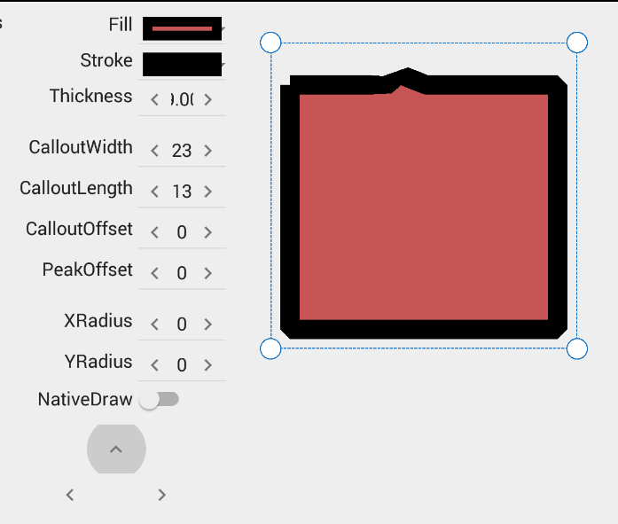
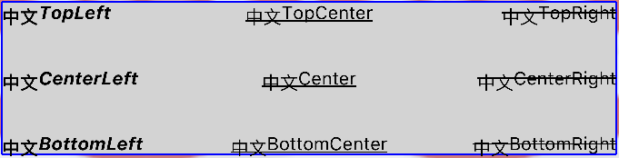
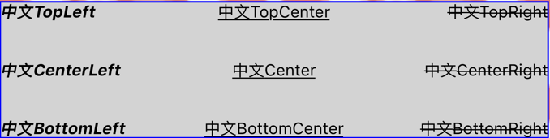

## INativeCanvas

We know the firemonkey's canvas is very bad quality on mobile platforms<br>
  <br>

After Aone's hard work we can use native method drawing the graph, you can get same quality as native mobile platform, Aone's method is using helper class to TCanvas, you must static decide use native or firemonkey to draw graph, I changed it to a INativeCanvas interface, you can change the method at runtime.

  <br>

this is the compare of Firemonkey Canvas and INativeCanvas FillText method<br>

  <br>
  <br>


All you need is add several lines.

```pascal
procedure TFMXCallout.Paint;
var
  Canvas: INativeCanvas;
  Method: TDrawMethod;
begin
  if Self.NativeDraw then
    Method := TDrawMethod.Native
  else
    Method := TDrawMethod.Firemonkey;
  Canvas := Self.Canvas.ToNativeCanvas(Method);

  Canvas.NativeDraw(LocalRect, procedure begin // 原生繪圖 by Aone, 暱名函數裡加入繪圖方法, 內部會先畫到 Bitmap
    Canvas.FillPath(FFillPath, AbsoluteOpacity, Fill);
    Canvas.DrawPath(FPath, AbsoluteOpacity, Stroke);
  end);                                       // 原生繪圖 by Aone, 結束後會顯示這個 Bitmap
end;
```