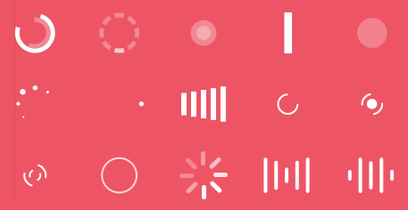
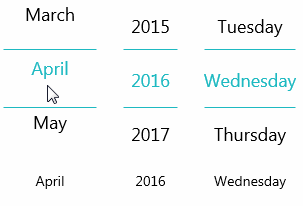
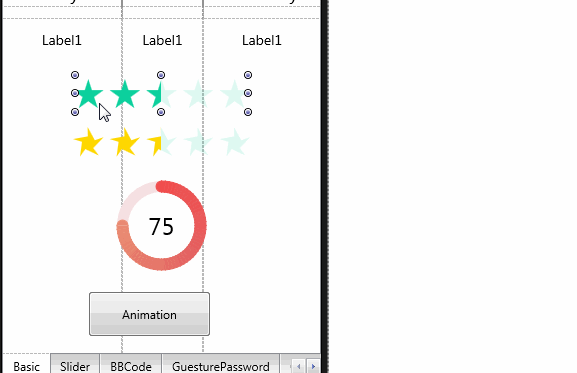
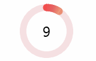
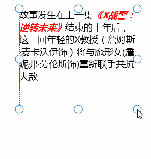
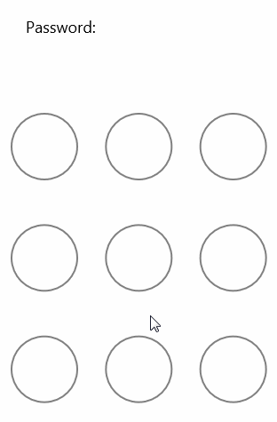
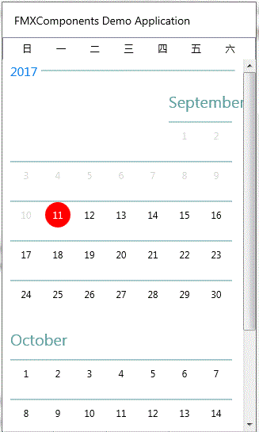
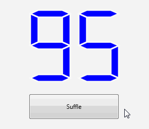
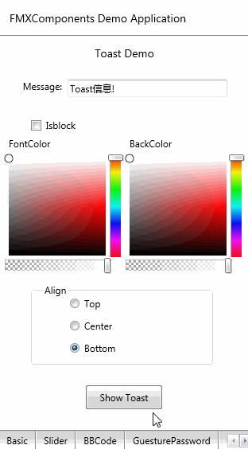
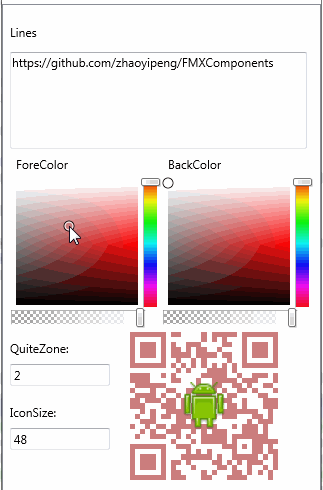

# FMXComponents

This project includes the components that donors and I have actually used in applications.  
If you have some components want to add into this project, you can send it to zhaoyipeng@hotmail.com

本项目包括本人及捐赠人实际应用中使用的控件

## 12.TFMXLoadingIndicator  (New)

  

Loading indicator port from [LoadingIndicators.WPF](https://github.com/100GPing100/LoadingIndicators.WPF)

 
## 1.TFMXScrollableList

  

A Simple Firemonkey Scrolleable List Component  

这是一个简单的滚动列表控件，可以用于选择年份或其它信息  
 
选项使用 Items 属性  

## 2.TFMXRatingBar  

 

 

A Simple Rating BarComponent  

这是一个简单的评级控件，目前只支持显示 
 
Rating property is Value  

评级属性为Value  

## 3.TFMXCircleScoreIndicator

  

A Simple Circle Score Indicator  

这是一个简单的成绩显示控件  
 

score property is Value  

成绩属性为Value  

## 4.TFMXImageSlider

  

A Simple Image Slider

一个简单的图片轮播控件（还不完善）
 
## 5.TFMXSimpleBBCodeText

  

A Simple BBCode Text Display Control 

一个简单的BBCode显示控件，实现简单的富文本显示

感谢 龟山Aone 的提示，TFMXSimpleBBCodeText性能得到了极大地优化，基本达到实用程度

## 6.[TFMXGuesturePassword](Documents/FMXGesturePassword.md)

  

A Guesture Password input Control 

手势密码输入控件

## 7.[TFMXCalendarControl](Documents/FMXCalendarControl.md)

  

A calendar component like iOS style

类似iOS风格的日期控件

## 8.[百度地图SDK](BaiduMapSDK/)

### 感谢 xubzhlin 的捐献 
BaiduMap SDK for Firemonkey 
百度地图SDK

## 9.TFMXSeg7Shape

Segment 7 Shape Firemonkey Componet create by Yamasho

  

七段式数字显示控件

原始项目地址为：
https://github.com/qa65000/Seg7ShapeFmx

## 10.TFMXToast

  

TFMXToast is a toast component using pure fmx 
使用纯FMX的Toast控件 
参考了Aone的文章：http://www.cnblogs.com/onechen/p/7130227.html   

## 11.TFMXQRCode

  

A QRCode display component 
use DelphiZXingQRCode to generate QRCode image 

